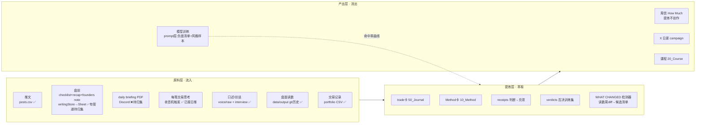

# 内容流程化总设计（CONTENT FLOW v1）
> Andy 2026-08-30 立项：「从每周产生的内容里提炼，而非再次创作。原材料→提炼→产出→训练，文件管理一一对应。」OPS 设计，各线认领管道。

## 总图

## 萃取函数（每次提炼回答同一组问题）
**当时什么变了 / 我怎么判断 / 我怎么做 / 后来怎样 / 下次规则是什么。** 答不全的原料留在原料层，不硬提炼。

## 文件管理一一对应表
| 原料 | 家（格式） | 进管道 | 出（谁调用） | 维护 |
|---|---|---|---|---|
| 推文+读数回填 | `data/content/posts.csv` | 日推回填 | 周信/关卡/看板 | Steve |
| checklist/recap/**founders note** | Sheet（writingStore, kind+date）→ 归集镜像 `Fluxus_Brand/record/writing/<kind>/<date>.md` | **★挂单：GAS 拉取**（照 shortlist_pull 模式，每晚 cron 顺拉） | 周信上周小结/蒸馏站 | 数据端建管道，Steve 消费 |
| daily briefing PDF | `Fluxus_Brand/record/briefings/<date>.pdf` | **★挂单：Discord 归集器**（只读，与深检④历史发言抓取同一工程） | 周信/档案 | Gary 建，Steve 消费 |
| 每笔交易思考 | `voice/raw/` → 蒸馏 → vault `50_Journal/trades/` | 收音机「每笔」触发 ✅ | 周信案例/课程/#002 票根类 | 日推问，蒸馏站切 |
| 口述/访谈 | `voice/raw/` + vault `90_Inbox/interview/` | 任何窗口 ramble ✅ | Method 卡/课程 | OPS 蒸馏 |
| 盘面读数 | `data/output/` git 历史 ✅ | cron ✅ | **★挂单：WHAT CHANGED 检测器**——周 diff 关键读数（regime/宽度/atr_ext 分布/主题轮动）自动出候选清单，周信段2从「回忆」变「勾选」 | 数据端/夜班建 |
| 交易记录 | `data/portfolio/*.csv` ✅ | 导出 | trade卡/绩效/三批法量化 | Andy 导出 |
| 研究结论/NULL | `claims.jsonl`+素材箱 ✅ | 各线 | BUILD 帖/playbook 卡 | 各线 |

## 训练闭环（如实说明：prompt 层，非微调）
verdicts（否决+一字理由）+ Andy 改写 diff + raw 原话 → 喂备稿/蒸馏站的负面清单与风格样本；**命中率曲线（Steve 周报）= 训练效果仪表**。

## 阅读侧（方便 Andy）
看板「项目/今日」引数字 · vault 是体系视图 · `record/` 是编年档案视图 · 周信是对外提炼终点。一种原料只有一个家；找不到家的新原料先进 `90_Inbox/`。
