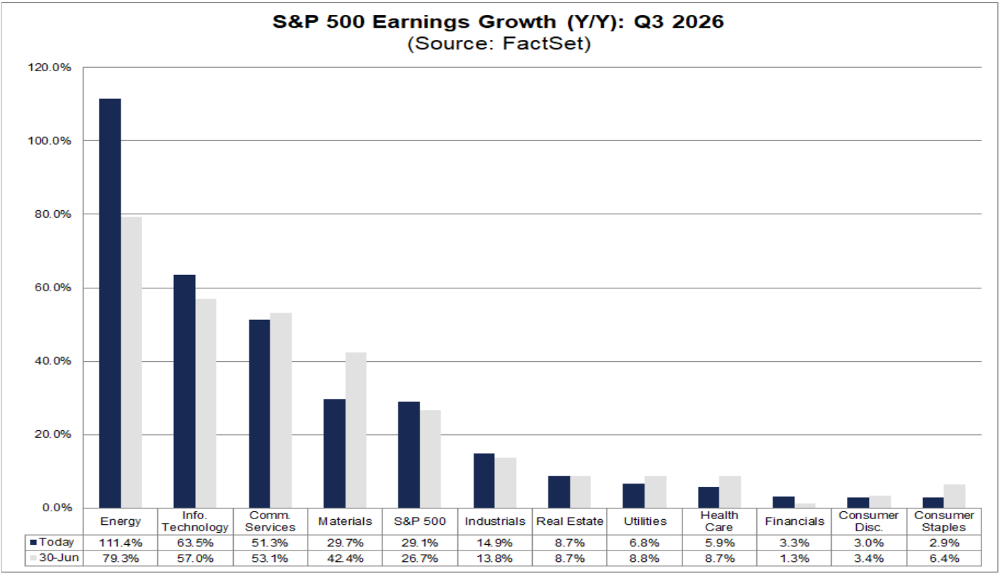
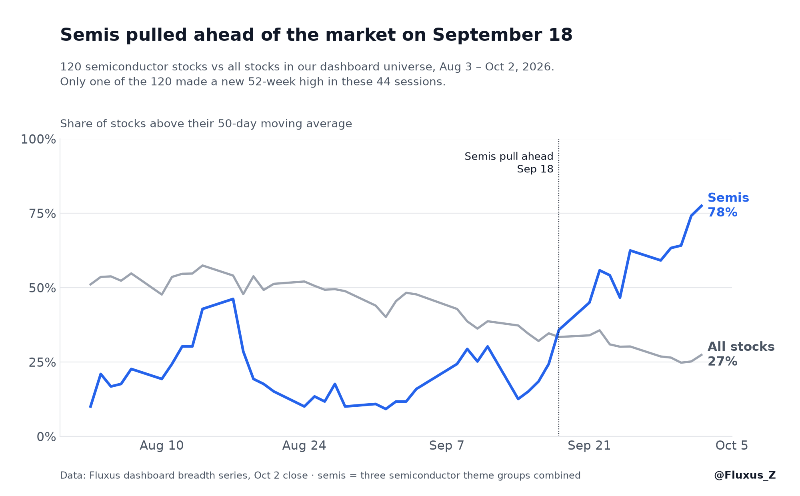
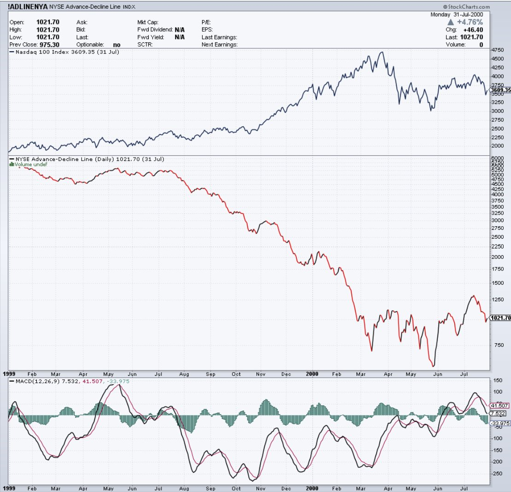
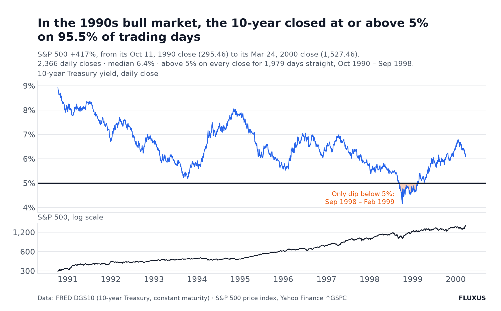

# 宽度 · 稿 v6（2026-10-04）

*Writer Mia 执笔。语言 EN（对外稿）。v5 → v6 按 Andy 10-04「别人观点可以放入更多，但整个文章逻辑也通顺」：加回五条别人的观点，全部转述、不挂名。之前 v4 → v5 按 Andy 10-04「别人的观点精简，但是整篇文章的逻辑要通顺」「确认我们数据是最新的周五10/2收盘后的数据」：全部数字换到 10-02 收盘，理顺段落衔接。*
*〔方括号〕＝待补槽。*

---

〔标题槽 · 工作标题：**Breadth is the worst in years. I'm still long semis.**〕

Nearly three out of four US stocks are below their 50-day moving average. Traders call this kind of reading breadth: how many stocks are joining a move, not just how far the index moves. Since early August, the semiconductor ETF is up 16%. On X, people are calling it the weakest breadth since the dot-com bubble.

I've argued both sides of this in my Discord over the past two weeks. Once I said the breadth worry didn't matter. A few days later I said it was exactly what could end the trade. Here are both arguments, side by side.

## How bad it is

From our dashboard, after the close on Friday, October 2:

| | |
|---|---|
| Stocks above their 50-day average | **27.43%** |
| Stocks above their 200-day | **37.50%** |
| New 52-week highs vs new lows (common stock only) | **7 vs 27** |
| McClellan oscillator, NYSE | **−15.58** |
| McClellan oscillator, Nasdaq-100 | **+50.21** |

The McClellan oscillator measures whether more stocks are rising or falling each day, smoothed over a few weeks. Below zero means more stocks are falling. The last two rows are that same indicator on two different lists of stocks. On the NYSE it reads like a selloff. On the Nasdaq-100 it reads like a rally.

That's why the breadth argument on X goes in circles. One side posts the NYSE reading and calls it a breakdown. The other side posts the Nasdaq reading and calls it the start of a new rally. Breadth is bad. It just isn't bad everywhere.

## Why it's bad: the train hit the brakes

Think of liquidity, the speed at which money is flowing into markets, as the speed of a train.

This year the train didn't stop. Somebody hit the brakes: the Fed hiking on one side, the Treasury propping up the bond market on the other. If the braking is clean, the train keeps going, just slower. If it's clumsy, the ride gets bumpy. The market right now is the sum of two forces, the momentum it already had and the push-back from the brakes.

The brakes don't hit every car the same way. Rate hikes made breadth bad because companies that don't make much money now make even less. That's much of the small-cap Russell 2000 (IWM). When rates stay high, what holds up is cash flow plus growth, and only a few sectors have both.

Rates matter this much because of where they are. The 10-year yields about 5.2%. That means a Treasury pays you about 1/19 of its price every year, a P/E of about 19. The S&P 500 trades at 19.0 times forward earnings. When a bond pays about the same as the index, a stock has to earn its place with real earnings growth. Small companies with thin margins and no pricing power can't.

And real earnings growth is in very few places. FactSet's estimates for this quarter, as of October 2:

Energy tops the chart, but it is a small sector and its number swings with oil prices. The S&P 500 is expected to grow earnings 29.5%. Six of the eleven sectors are growing at single digits. Financials are at 3.0%. Consumer staples are at 2.9%. Those are the cars the brakes hit hardest.

Traders who split breadth by group find the same pattern. The damage is in small caps, the equal-weight S&P 500, utilities, homebuilders and banks. Inside semis, software and cybersecurity, breadth looks fine.

Our own numbers back up the semis part. We track 120 semiconductor stocks. On October 2, 78% of them were above their 50-day average, against 27% for all stocks. On the 200-day it was 70% against 38%.

The 50-day lead is new, though. Before September 18, semis were behind the market, by as much as 42 points. And in those 44 sessions, only one of the 120 made a new 52-week high. The median stock is still 29% below its high. Semis are climbing back from a drawdown. They haven't broken out to new highs yet.

So semis are one of the cars the train is still pulling. They are pulling out of a deep hole, though.

## Why I'm still long semis: the chart

Semis are up 16% since August 3, through the October 2 close. SOXX and SMH moved almost together, +16.1% and +15.6%. SMH is now about 6% below its June high. The ETF is closer to its high than the typical semi stock because its biggest holdings, like NVDA, have done most of the work. When they lead, they really lead.

I watch the rotation inside the group more than the index. Over the last month money has moved from one sub-theme to the next. CPUs went first (AMD, ARM, INTC), then memory (MU, SNDK), then photonics, then equipment (LRCX, KLAC, AMAT on September 29). On October 1 it was the small semis: TSEM, FORM and SMTC broke out. A group that rotates inside itself can keep going for a long time. That's also why I'd rather hold SOXX itself than guess the next sub-theme.

On pullbacks, SOXX has held at the anchored VWAP from its all-time high, which is the average price everyone who bought since that high has paid. When I checked MU on September 22, it hadn't run too far above its 50-day average, measured in ATR (average daily range). On the September 28 gap-down I could see put sellers stepping in on semis, traders betting the price would hold. They usually put in the low of the day.

## Why I'm still long semis: the business

When rates stay high, the market pays for cash, and these companies make a lot of it.

CPUs are getting re-rated. ARM, AMD and INTC sell into the agentic-AI build-out and are also a bottleneck in it, and OpenAI and Meta are big customers. Foundries have the deepest moat in AI, and TSMC and Intel are already short of capacity. MU's September 30 quarter was huge. NVDA announced a $150 billion buyback on September 28.

The same FactSet report has one more number. Semiconductors and semiconductor equipment are expected to grow earnings 130% this quarter. Take them out and the technology sector's growth falls from 65.0% to 24.4%.

Semis and AI are still going up. They're still my first choice.

## The case against me

My own words, October 1:

> "Narrow leadership is normally fine for a while, but if everything else continues to worsen, it means everyone is hiding in those leaders. At one point there will be no buyers left, and macro will crash it too."

History has examples. Here is 1999. The top panel is the Nasdaq-100. The middle panel is the NYSE advance-decline line, a running total of rising stocks minus falling stocks each day. You can ignore the bottom panel:

The NYSE advance-decline line rolled over in the summer of 1999 and fell almost without a break into March 2000. When the Nasdaq-100 finally topped, the line was already near its low. Breadth was right in the end. It was about eight months early.

Other traders have made the case sharper. One counted only two times in the past two years when breadth was worse than now, in March–April 2025 and March 2026, and couldn't find a past case of SPY sitting this close to its high with breadth this weak. Another pointed to the ratio of the equal-weight S&P 500 to the Nasdaq-100, which is at an extreme. His view: the rotation into the rest of the market should come. If it doesn't, that's when to worry, because it means money is leaving stocks altogether. That's the same "no buyers left" ending I described above.

2007 went the same way. The NYSE advance-decline line peaked at the beginning of June. The NYSE Composite made new highs in July and again in October, and the S&P 500 topped on October 9, about four months after breadth. In late 2021, by one strategist's account, the line stalled for nearly six months before the correction that started in January 2022.

## The case for ignoring it (for now)

Also my own words, September 28:

> "Bad breadth can continue while money piles into narrow leadership. Look at 1999."

Go back to the same chart. During those eight months of falling breadth, the Nasdaq-100 roughly doubled, from about 2,300 to about 4,700.

In the same post I said crowded doesn't mean reversal. In a secular bull market, macro worries sometimes stay worries.

I'm not the only one making the 1999 comparison. Others on X see the same thing: money squeezing into a handful of high-return giants, the way it did during the 1999 rate-hike cycle. One trader noted that the share of stocks above the 50-day in his universe had dropped below 30%, the weakest since March, and that last time it stayed weak for weeks before turning. In the same post he said he had more names to trade than at any point since April.

The other big worry is rates. Today people worry about a 10-year above 5%. In the 1990s, 5% was the floor.

From its October 1990 low to its March 2000 peak, the S&P 500 rose 417%. On 95.5% of those 2,366 trading days, the 10-year closed at or above 5%. It stayed above 5% on every close for 1,979 days in a row, until LTCM and Russia pushed it under in September 1998. The median close for the decade was 6.4%.

You can build a scary backtest out of high yields, weak breadth and an index near its high. Each of those has come before big drawdowns. But a pattern from the past only holds if nothing important has changed. Change earnings, valuations or liquidity, and the same setup can end very differently. What's different this time is earnings, and most of them are in semis.

〔收口槽 —— Andy 亲笔。边界：不写对仗格言、不复述以上内容、收在下一步或一个邀请上。〕

---

## 🔴 交接

**v5 → v6：加回别人的观点（Andy 10-04「别人观点可以放入更多，但整个文章逻辑也通顺」「留着最后那句」）**
全部转述、不 @、不挂名；每条放在逻辑上需要它的位置：
| 放在哪 | 加了什么 | 原出处（只在这里留档，不上稿） | 起什么作用 |
|---|---|---|---|
| 开头 | X 上有人说这是互联网泡沫以来最弱的宽度 | @ConnorJBates_（x-watch 09-29） | 交代这场争论的由来 |
| 第 1 段 | X 上两派各贴一个读数，一边喊崩、一边喊 thrust | x-watch 09 月下旬多帖 | 解释 McClellan 两个读数为什么吵不完 |
| 第 2 段 | 按板块拆宽度：差在小盘、等权标普、公用事业、房屋建筑、银行；半导体、软件、网安不差 | @ConnorJBates_ 09-30 | 从 FactSet 盈利图过渡到我们的半导体数据 |
| 反方 | 过去两年只有两次比现在差、找不到 SPY 离高点这么近而宽度这么差的先例；RSP/QQQ 到极端，轮动不来就是资金离场 | @Signal_Sigma · @thesetupfactory | 接在你 10-01 那段「没有买家」引文后面，把它说得更具体 |
| 反方 | 2021 年底腾落线停滞近六个月后才回调 | RIA Lance Roberts（2025-03-11） | 第三个历史例子，写成「by one strategist's account」，不写我们核不到的精确日期 |
| 正方 | 别人也在拿 1999 加息周期做类比；有人说他的池子 50 日线跌破 30%，但可做的票是 4 月以来最多 | @ArtofSpecuycky · @RealSimpleAriel | 说明「宽度差」和「有好机会」可以同时成立 |

没加回来的：科技股占标普 39.5%、超过 2000 年 3 月纪录。这个数核不到，不挂名写出来就变成我们的断言。

正方最后一句「What's different this time is earnings, and most of them are in semis.」按你 10-04「留着最后那句」保留。

数字仍全部是 10-02 收盘口径，明细见 `DRAFT_v5.md` 交接节。

**新手冷读（10-04，干净子 agent，扮演交易一年、没听过 breadth 的散户）**：会读完；最想停在技术面那段（anchored VWAP / ATR / put sellers）和开头表格的 McClellan。据此改了：
- 第一次出现 breadth、McClellan、腾落线、anchored VWAP、ATR、put sellers 时各加半句白话解释。
- 「That's IWM」写成小盘股罗素 2000；FactSet 图里能源 114% 最高，正文补一句「能源是小板块、跟油价走」，不然和「盈利只在少数地方」对不上。
- ETF 离高点 6%、中位股离高点 29% 补一句和解：ETF 靠 NVDA 等大权重股拉着。
- 火车比喻接回：「semis are one of the cars the train is still pulling」。
- 删了冷读挑出的复述式短句：「Both are looking at real numbers…」「A large part of the tech trade is the semis trade」「This has happened before more than once」「Being early on that trade was expensive」「Weak breadth and good setups can exist at the same time」；「Yields are the same story」换成「The other big worry is rates」。
- 「money printed」和「Fed 加息」读着自相矛盾，改成「money flowing into markets」。
- 买回写成 $150 billion（公司公开数字，不是账户金额）。
- 冷读还提了两点我**没改**，留给你判断：①「What's different this time」容易让人联想到那句著名的反讽格言（你说留着，照留）；②正方最后列出「earnings, valuations or liquidity」，而前文说标普 19 倍市盈率和国债差不多，等于估值比 90 年代更贵，懂行的读者会觉得这里自相矛盾。要不要把 valuations 删掉，你定。

**仍空着**：标题 · 收口。
